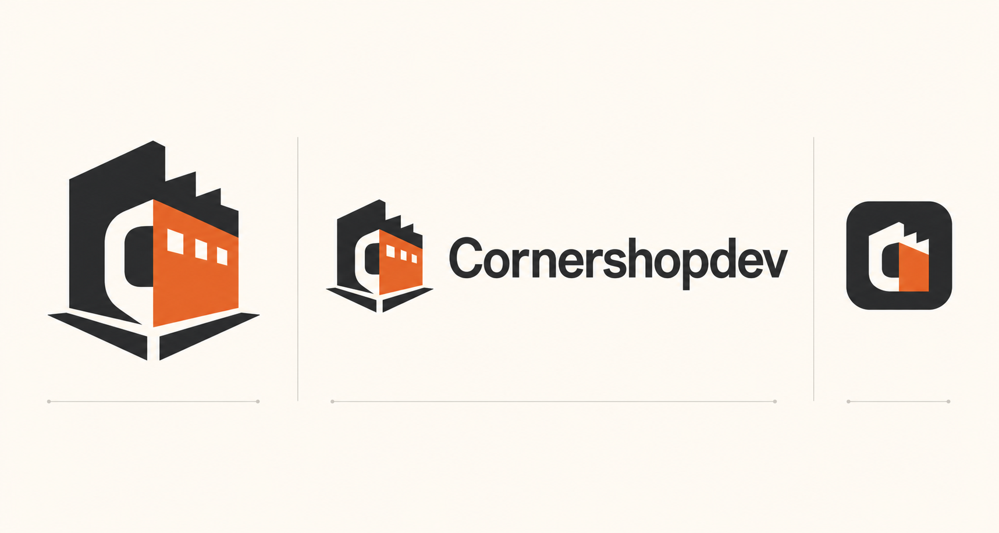
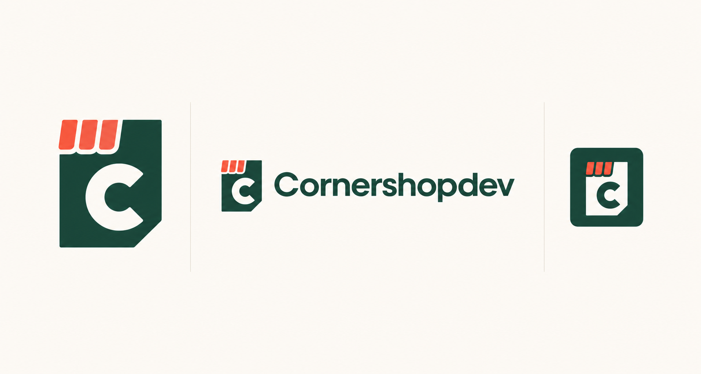
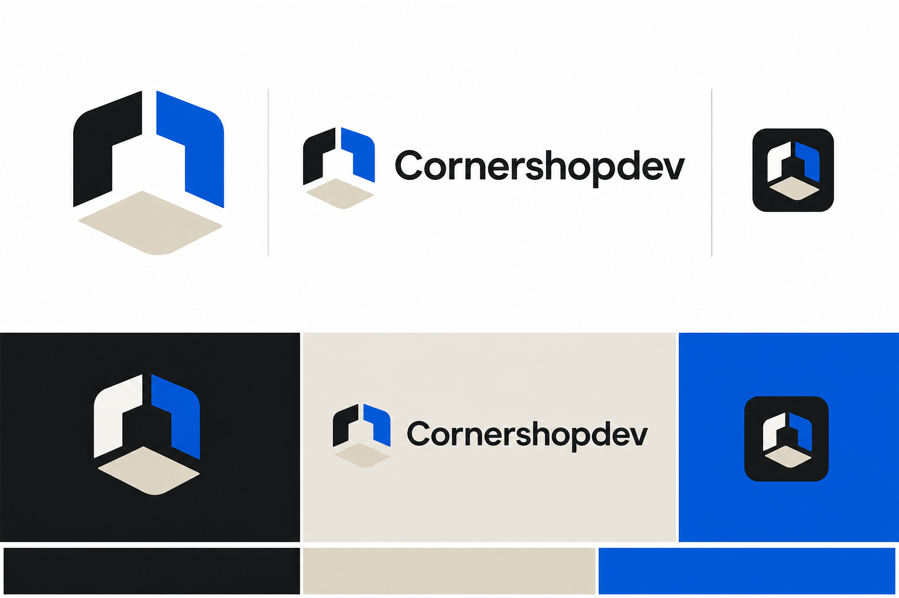
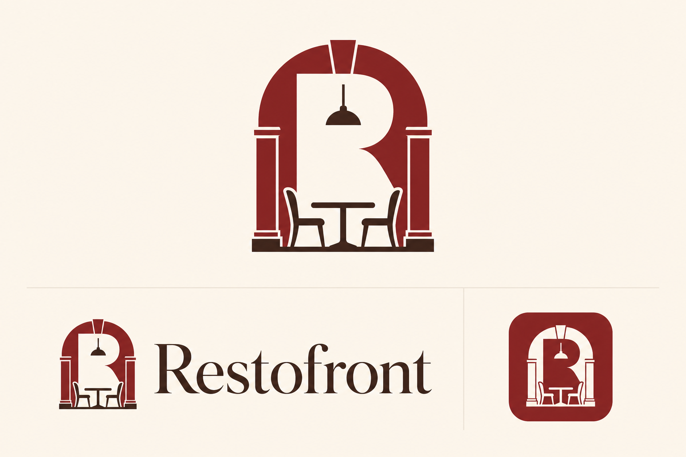
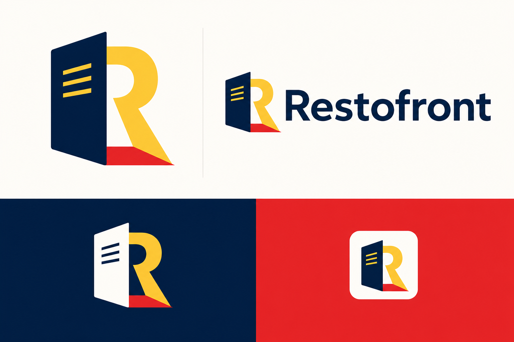
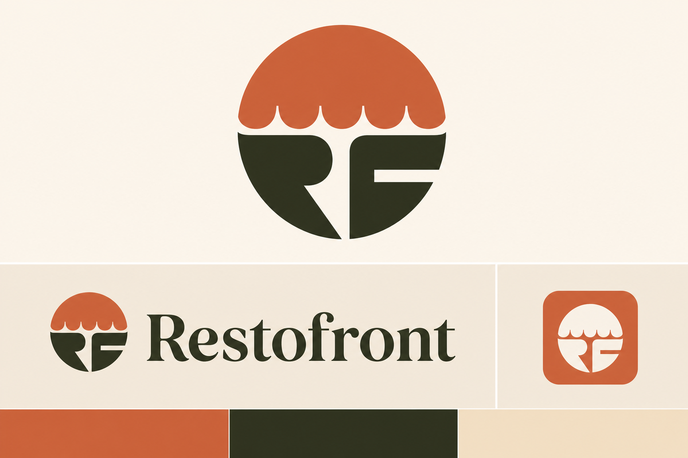
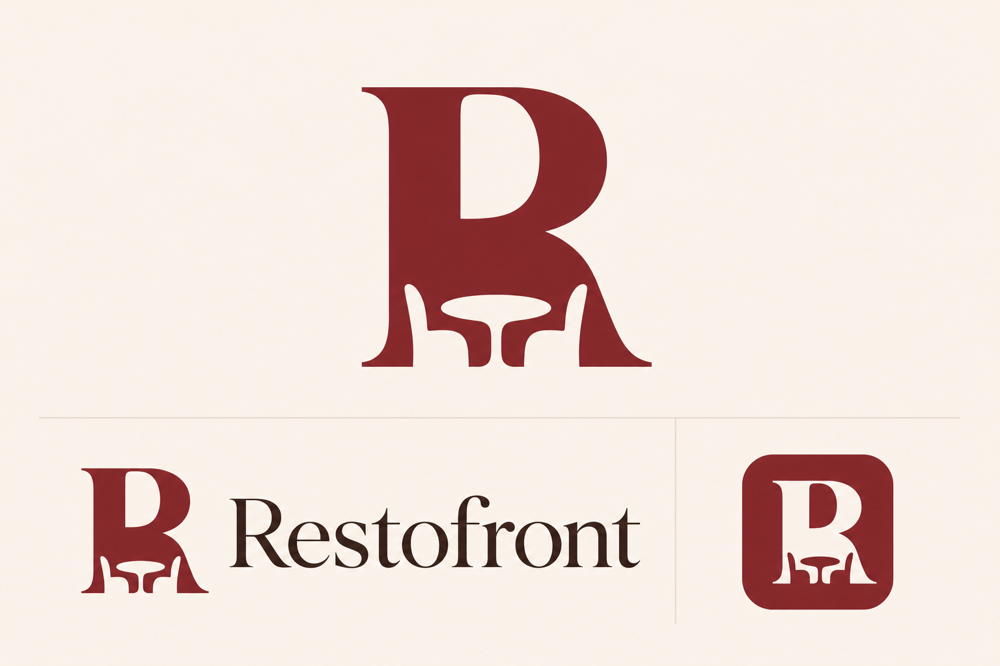
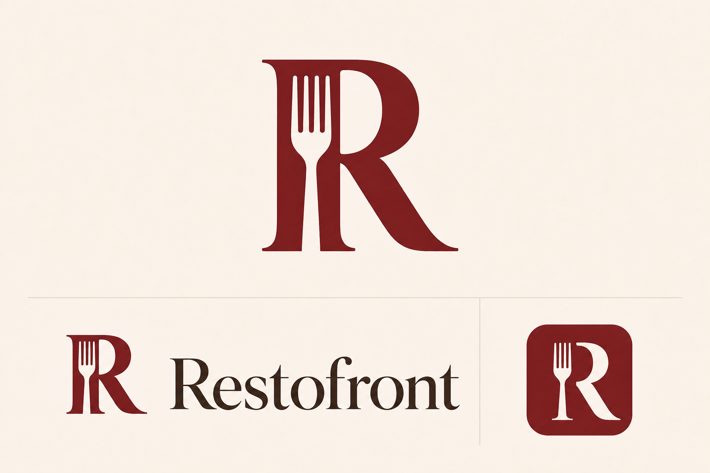
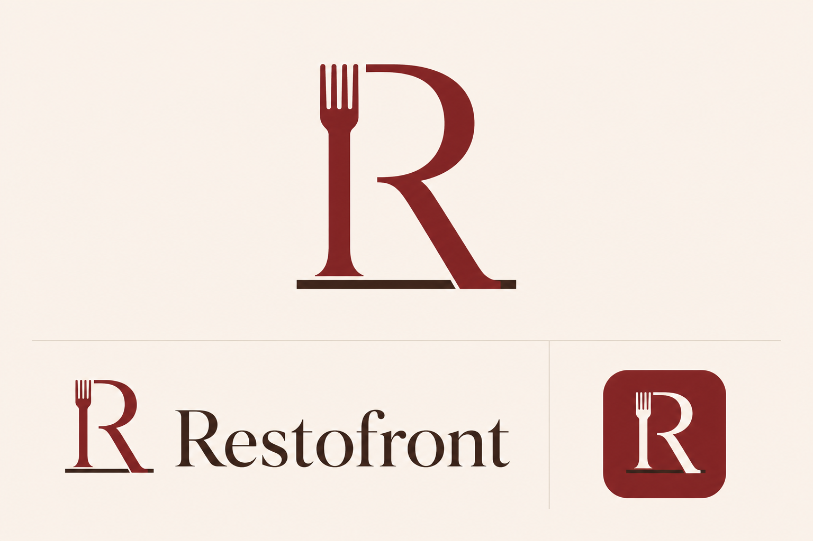

# Brand identity concepts

Generated with the built-in OpenAI image generator on 2026-07-26. These are
directional review boards. Restofront 05 is the selected direction; its chosen
favicon artwork has been prepared as production raster assets under
`public/brand/restofront/`. The flat 1024 × 1024 master is
`logo-square.png`; its exact burgundy is recorded in the root `DESIGN.md`.

## Cornershopdev

### 01 — Modular corner

Prompt: Create a vector-friendly identity board for “Cornershopdev,” an
open-source website factory for small local businesses. Merge a street-corner
silhouette with a modular factory/building block and form a subtle C in negative
space. Show a standalone mark, horizontal wordmark, and favicon tile. Use
charcoal, warm cream, and burnt orange. Keep the silhouette bold and avoid
shopping carts, globes, gears, clip art, gradients, slogans, and extra text.

### 02 — Folded corner

Prompt: Create a vector-friendly identity board for “Cornershopdev.” Use one
asymmetrical folded web-page tile with a clipped lower-right corner, three short
awning stripes along only the upper-left edge, and a C in negative space. Show
only an unlabelled standalone mark, the exact wordmark once, and a favicon tile.
Use forest green, parchment, and coral. Avoid mirrored uprights, central towers,
anatomical silhouettes, bags, carts, floating HTML tags, gradients, captions,
slogans, and extra words.

### 03 — Corner grid

Prompt: Create a Swiss-modern identity board for “Cornershopdev.” Use three
interlocking modular tiles whose negative space suggests a street corner and the
letter C, expressing one system creating many storefronts. Show a standalone
mark, exact wordmark, and favicon tile. Use near-black, warm stone, and cobalt.
Avoid generic cubes, blockchain aesthetics, corporate SaaS symbols, gradients,
slogans, and extra text.

## Restofront

### 01 — Table front

Prompt: Create a warm contemporary hospitality identity board for
“Restofront,” a restaurant storefront product that keeps menus, bookings, and
hours current. Merge a restaurant doorway or façade arch with a table for two,
with an R in the negative space. Show a standalone mark, exact wordmark, and
favicon tile. Use oxblood, warm cream, and espresso. Avoid chef hats, crossed
cutlery, cloches, cartoon food, crests, gradients, slogans, and extra text.

### 02 — Menu doorway

Prompt: Create a crisp modernist hospitality identity board for “Restofront,” a
digital front door for independent restaurants. Make a folded menu card double
as an open doorway, with a bold R emerging from the fold. Show a standalone
mark, exact wordmark, and favicon tile. Use deep navy, butter yellow, and tomato
red. Avoid QR codes, delivery imagery, fork-and-knife clichés, gradients,
slogans, and extra text.

### 03 — Plate front

Prompt: Create a bold Mediterranean-editorial identity board for “Restofront.”
Intersect a simple circular plate with a storefront awning or façade line to
create an RF-like negative-space monogram. Show a standalone mark, exact
wordmark, and favicon tile. Use terracotta, olive-black, and pale sand. Avoid
generic plate-and-cutlery icons, chef hats, pizza slices, ornate crests,
gradients, slogans, and extra text.

## Restofront classy burgundy studies

These studies return to the strongest territory from the first board: deep
burgundy, warm cream, espresso, an editorial serif, and an unmistakable
restaurant cue. Rejected chair reductions and Cornershopdev-style experiments
are intentionally excluded.

### 04 — Table monogram

Prompt: Build a bold burgundy R as the primary silhouette. Inside its lower
bowl, use cream negative space for one round table and two minimal chair backs.
Use no more than four interior shapes, no chair legs, and no architecture. The
mark should read as R first and intimate dining second. Show a standalone mark,
exact wordmark, and rounded-square favicon.

### 05 — Fork R (selected)

Prompt: Cut one cream four-tine fork cleanly through the vertical stem of a bold
burgundy R. Keep the R unmistakable and let the fork handle transition into its
diagonal leg without adding any other utensil or restaurant object. Show a
standalone mark, exact wordmark, and rounded-square favicon.

### 06 — Fork counter

Prompt: Draw one continuous burgundy R above a short espresso counter line. End
the upper-left vertical in four understated fork tines and let the lower
diagonal meet the counter like a table support. Use thick, restrained geometry
with no enclosing shape except on the favicon. Show a standalone mark, exact
wordmark, and rounded-square favicon.
