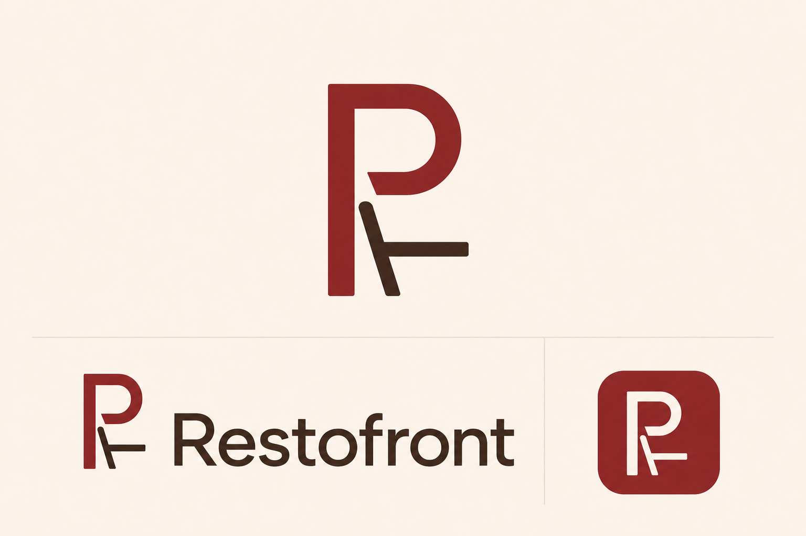
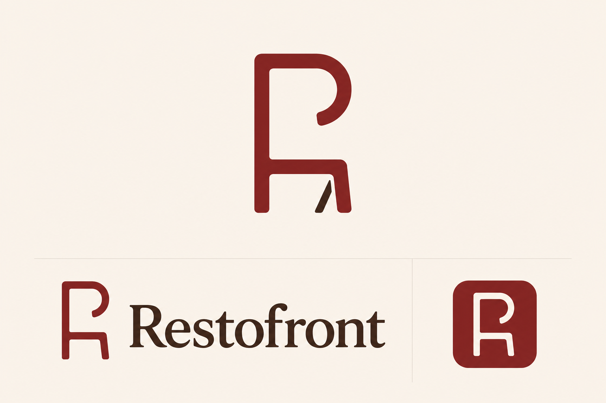
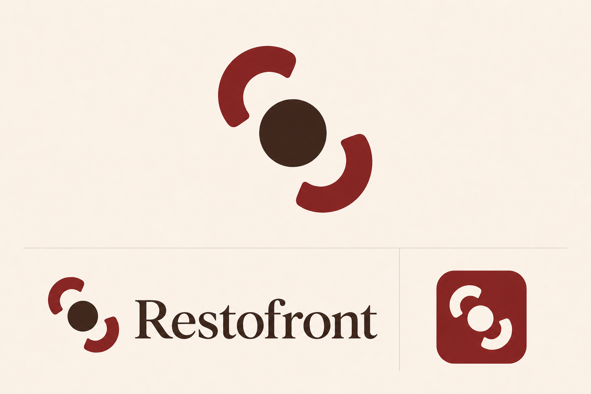

# Brand identity concepts

Generated with the built-in OpenAI image generator on 2026-07-26. These are
directional review boards, not production logo files. Once a direction is
selected, redraw the mark as SVG, tune the wordmark, and export the favicon set
from that controlled vector source.

## Cornershopdev

### 01 — Modular corner

Prompt: Create a vector-friendly identity board for “Cornershopdev,” an
open-source website factory for small local businesses. Merge a street-corner
silhouette with a modular factory/building block and form a subtle C in negative
space. Show a standalone mark, horizontal wordmark, and favicon tile. Use
charcoal, warm cream, and burnt orange. Keep the silhouette bold and avoid
shopping carts, globes, gears, clip art, gradients, slogans, and extra text.

### 02 — Folded corner

Prompt: Create a vector-friendly identity board for “Cornershopdev.” Use one
asymmetrical folded web-page tile with a clipped lower-right corner, three short
awning stripes along only the upper-left edge, and a C in negative space. Show
only an unlabelled standalone mark, the exact wordmark once, and a favicon tile.
Use forest green, parchment, and coral. Avoid mirrored uprights, central towers,
anatomical silhouettes, bags, carts, floating HTML tags, gradients, captions,
slogans, and extra words.

### 03 — Corner grid

Prompt: Create a Swiss-modern identity board for “Cornershopdev.” Use three
interlocking modular tiles whose negative space suggests a street corner and the
letter C, expressing one system creating many storefronts. Show a standalone
mark, exact wordmark, and favicon tile. Use near-black, warm stone, and cobalt.
Avoid generic cubes, blockchain aesthetics, corporate SaaS symbols, gradients,
slogans, and extra text.

## Restofront

### 01 — Table front

Prompt: Create a warm contemporary hospitality identity board for
“Restofront,” a restaurant storefront product that keeps menus, bookings, and
hours current. Merge a restaurant doorway or façade arch with a table for two,
with an R in the negative space. Show a standalone mark, exact wordmark, and
favicon tile. Use oxblood, warm cream, and espresso. Avoid chef hats, crossed
cutlery, cloches, cartoon food, crests, gradients, slogans, and extra text.

### 02 — Menu doorway

Prompt: Create a crisp modernist hospitality identity board for “Restofront,” a
digital front door for independent restaurants. Make a folded menu card double
as an open doorway, with a bold R emerging from the fold. Show a standalone
mark, exact wordmark, and favicon tile. Use deep navy, butter yellow, and tomato
red. Avoid QR codes, delivery imagery, fork-and-knife clichés, gradients,
slogans, and extra text.

### 03 — Plate front

Prompt: Create a bold Mediterranean-editorial identity board for “Restofront.”
Intersect a simple circular plate with a storefront awning or façade line to
create an RF-like negative-space monogram. Show a standalone mark, exact
wordmark, and favicon tile. Use terracotta, olive-black, and pale sand. Avoid
generic plate-and-cutlery icons, chef hats, pizza slices, ornate crests,
gradients, slogans, and extra text.

## Restofront simplified chair studies

These studies reduce the table-front direction to favicon-grade geometry. The
original board remains above as the source direction rather than a final mark.

### 04 — R chair

Prompt: Reduce the original R, chair, and table identity to an R-first monogram
made from at most four bold strokes. Let one angled stroke imply a chair back and
one horizontal stroke imply a table edge. Remove the arch, columns, lamp, floor,
chair legs, and ornamental detail. Show a standalone mark, exact wordmark, and
favicon tile in oxblood and espresso.

### 05 — Chair doorway

Prompt: Create a single continuous dining-chair silhouette whose back and seat
also form an open doorway or lowercase R. Keep the mark reductive, soft-cornered,
and readable at 16px. Remove all building and room detail. Show a standalone
mark, exact wordmark, and favicon tile in oxblood, cream, and espresso.

### 06 — Table for two

Prompt: Create an asymmetrical top-down table-for-two symbol from exactly three
bold shapes: one small table and two C-shaped chairs placed diagonally toward it.
Avoid mirrored pillars, H shapes, pause symbols, and restaurant clichés. Show a
standalone mark, exact wordmark, and favicon tile in oxblood and espresso.
