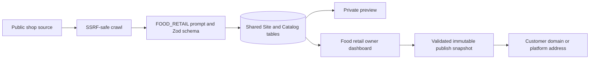

# FOOD_RETAIL vertical

`FOOD_RETAIL` covers independent bakeries, pâtisseries, butchers, delis,
cheesemongers, grocers and similar local food shops. It is a retail storefront,
not a full-service restaurant mode.

## System flow

## Vertical boundary

- Product ranges use the shared `CatalogSection` / `CatalogItem` relations.
- `Site.attributes` stores `shopType`, product-gallery preference and sourced
  pickup details.
- `CatalogItem.attributes` stores nullable, evidence-backed stock status,
  seasonal availability, explicit preorder state/note, allergens and allergen
  evidence. The shared `available` column controls storefront visibility only.
- Ordering, click-and-collect and preorder URLs use the shared `ORDERING`
  integration. Courier marketplaces use `DELIVERY`.
- The renderer selects ordering as the primary mobile CTA and sets booking
  request mode to `never`. No missing-link fallback can create a reservation
  form.
- Store address and hours remain the shared canonical fields. Empty means the
  source did not provide the fact.

## Factuality contract

The importer and owner-save schema enforce these rules:

- no invented products, prices, stock, seasonal dates, preorder requirements,
  pickup promises or allergens;
- `price: null`, `stockStatus: null`, `preorderRequired: null`, empty strings and
  empty arrays are the normal unknown state;
- `stockStatus` can become `in-stock` or `out-of-stock` only with an exact HTTPS
  `stockSourceUrl`; unknown stock remains visible without a stock claim;
- any non-empty `allergens` array is invalid unless `allergenSourceUrl` is an
  exact HTTPS source URL;
- only source/owner/permissioned photography can be persisted, and enhancement
  cannot change the product, portion, package, label, finish or price sign;
- English/French translations change text only. Product order, prices,
  currencies, image references, integration URLs and allergen evidence stay
  canonical.
- Owner-added categories and products require a sourced canonical name before
  they are created. Locale overlays temporarily reuse that nonblank source text,
  remain `stale`, and cannot publish until the localized editor is completed and
  explicitly marked reviewed. Imported/generated overlays default to `draft`.

## Structured data

Live pages emit Schema.org JSON-LD only on the analytics-enabled public surface:

- `Bakery` for bakery and pâtisserie;
- `GroceryStore` for grocers;
- `Store` plus a precise `category` for butchers, delis, cheesemongers and the
  safe generic type;
- `OfferCatalog` / `Offer` / `Product` for visible, actually stored catalog
  entries, with Schema.org stock availability only when the status has source
  evidence;
- `OrderAction` only when a persisted ordering or delivery integration exists;
- price and currency only when the source-backed price is non-null.

The markup never emits `acceptsReservations` and deliberately omits allergen
claims: their source remains available to the owner/editor, but there is no
generic Schema.org product-allergen property that justifies publishing them as
an unqualified product fact.

## Persistence and migration

Migration `20260820120000_food_retail_vertical` adds the enum value only.
Existing generic JSON attribute bags and catalog/integration relations already
carry the vertical data, so no existing rows are rewritten and the migration
does not seed product facts. The owner PUT route parses FOOD_RETAIL drafts with
the registered schema before the shared optimistic-revision persistence path.

## Public launch gate

The code ships with all public launch selectors closed:

- `marketing.hostnames = []`
- `marketing.domain = null`
- `marketing.email = null`

Do not change those values or expose a priced public plan until the PR/release
contains reviewable evidence for every item below:

- [ ] production domain is owned, resolves to the intended ingress and is
      covered by the customer/niche routing policy;
- [ ] sending domain is verified with the mail provider, with a niche-specific
      `from` and monitored `replyTo` address;
- [ ] production billing product/price and checkout configuration are present in
      the reviewed environment without secret values entering git;
- [ ] production readiness covers database migration status, Redis, storage,
      billing, email and alerting;
- [ ] English and French fixture/import/renderer/dashboard tests pass;
- [ ] a real pilot shop has owner-confirmed products, prices, hours, pickup
      wording, images and any allergens before public publication.

Until those gates have evidence, FOOD_RETAIL remains usable for private imports,
previews and owner review only; it is excluded from `listMarketingVerticals()`.
